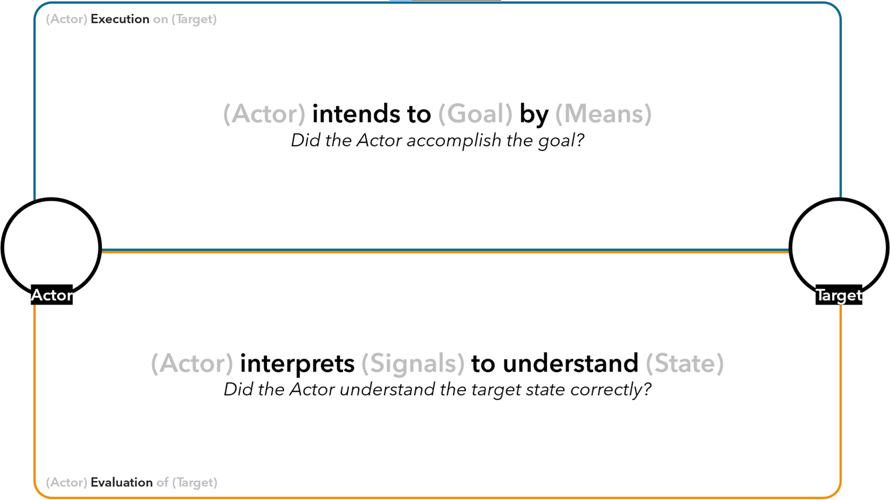

[Publisher](https://doi.org/10.3389/frvir.2025.1536393)

#### BibTex
```latex
@ARTICLE{10.3389/frvir.2025.1536393,
    AUTHOR={Caetano, Arthur  and Aponte, Alejandro  and Sra, Misha },
    TITLE={A design toolkit for task support with mixed reality and artificial intelligence},
    JOURNAL={Frontiers in Virtual Reality},
    VOLUME={Volume 6 - 2025},
    YEAR={2025},
    URL={https://www.frontiersin.org/journals/virtual-reality/articles/10.3389/frvir.2025.1536393},
    DOI={10.3389/frvir.2025.1536393},
    ISSN={2673-4192}
}
```

<iframe  src="https://www.frontiersin.org/journals/virtual-reality/articles/10.3389/frvir.2025.1536393/full" width="100%" height="1200px"></iframe>