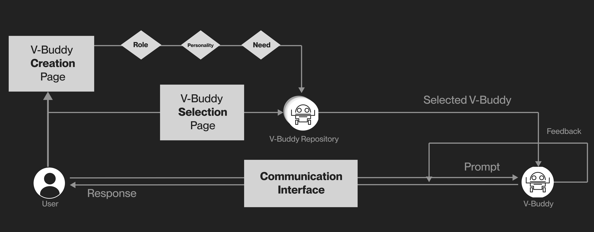

**🏆People’s Choice Best Poster**



[Publisher](https://doi.org/10.1145/3586182.3616680)

#### BibTex
```latex
@inproceedings{10.1145/3586182.3616680,
    author = {Taheri, Atieh and Bhardwaj, Purav and Caetano, Arthur and Zhong, Alice and Sra, Misha},
    title = {Virtual Buddy: Redefining Conversational AI Interactions for Individuals with Hand Motor Disabilities},
    year = {2023},
    isbn = {9798400700965},
    publisher = {Association for Computing Machinery},
    address = {New York, NY, USA},
    url = {https://doi.org/10.1145/3586182.3616680},
    doi = {10.1145/3586182.3616680},
    abstract = {Advances in artificial intelligence have transformed the paradigm of human-computer interaction, with the development of conversational AI systems playing a pivotal role. These systems employ technologies such as natural language processing and machine learning to simulate intelligent and human-like conversations. Driven by the personal experience of an individual with a neuromuscular disease who faces challenges with leaving home and contends with limited hand-motor control when operating digital systems, including conversational AI platforms, we propose a method aimed at enriching their interaction with conversational AI. Our prototype allows the creation of multiple agent personas based on hobbies and interests, to support topic-based conversations. In contrast with existing systems, such as Replika, that offer a 1:1 relation with a virtual agent, our design enables one-to-many relationships, easing the process of interaction for this individual by reducing the need for constant data input. We can imagine our prototype potentially helping others who are in a similar situation with reduced typing/input ability.},
    booktitle = {Adjunct Proceedings of the 36th Annual ACM Symposium on User Interface Software and Technology},
    articleno = {23},
    numpages = {3},
    keywords = {accessibility, conversational AI, hand motor disability, user-centric design, virtual personas},
    location = {San Francisco, CA, USA},
    series = {UIST '23 Adjunct}
}
```

<iframe  src='https://arxiv.org/pdf/2411.08228' width='100%' height='1200px'></iframe>
